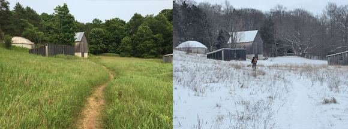
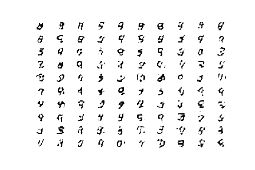
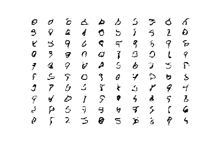
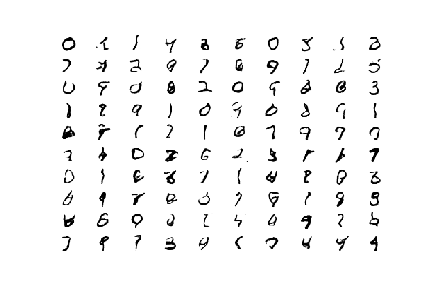

# Building a Generative Adversarial Network
## Generating MNIST Handwritten Digits

A face generated by a GAN.

## Goals and Overview

A Generative Adversarial Network (GAN) is a type of neural network for generative modeling. The generative model is trained using two neural network models: a generator and a discriminator. GANs are complex so to put them in laymen's terms, the way they work is there is a generator model that learns to generate plausible samples from a dataset. There is also a discriminator set that is provided with the same dataset and it's goal is to distinguish real data from fake data (data that is produced by the generator model). Both models enter a game, so to speak, where the generator seeks to fool the discriminator by learning and generating data that is so similar to the shared dataset that the discriminator is unable to distinguish generated data from actual data. This game that the models play is where the word "Adversarial" comes from in the network name. Being able to generate plausible data is a useful tool in a Data Scientist's kit if having more data is ever beneficial to a project where gathering more data is costly or impossible.

In this research project, I sought to learn about and become more familiar with GANs, and, in particular, image producing GANs. Because GANs are very computationally heavy, the MNIST dataset was selected for because it is a smaller, simpler dataset and thus less computationally taxing.

## Practical Applications of GANs

-As stated above, GANs are practical tool to generate plausible data from a dataset which allows those working on the dataset to have more data to work with.

-GANs can be used to enhance security software: by creating more types of attacks on a security network, the network can adapt to these innocuous attacks preparing it for plausible, new attacks in the future

-GANs can be used for Image Editing, giving artists and graphic designers new ways to modify their work as showcased below:

-GANs can be used for generating images from a learned dataset such as the face shown above. Generating new images was the scope of my research project.

## Generated Images

Here is an example of some digits that the discriminator model was trained on

The image above shows digits that have been produced by the generator model after 10 epochs. At this point, the generator has learned from the discriminator where to centralize crude digits.

After 50 epochs, the digits have gained more "curve" and begin to look more like digits.

After 100 epochs, even more smoothening has happened and the figures are resembling more and more like actual digits.

## Future Work

For my future work, I would like to create a GAN to generate faces as shown above. The added complexity of the images will pose new challenges with which to improve my knowledge of GANs. I hope to use this new technology in my field of work if ever it is applicable.